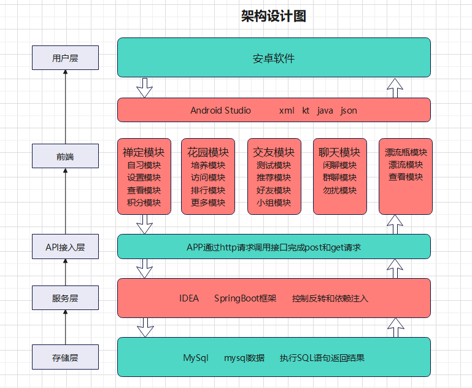

# 1.技术方案
|    开发    |     技术栈      |
| :--------: | :-------------: |
|    前端    |     Android     |
|    后端    | Java SpringBoot |
|   数据库   |      MySQL      |
| 数据库缓存 |      Redis      |

# 2.整体架构图

